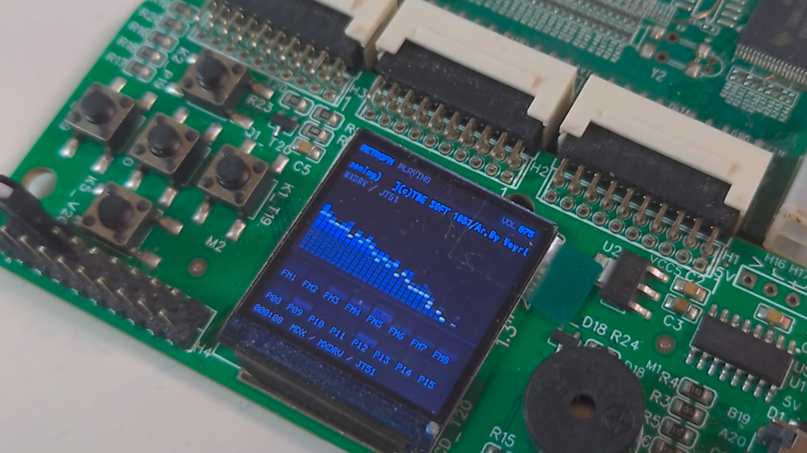

# EBAZ4205 向け RetroFM

[English](README.md) | 日本語

*EBAZ4205 実機での再生画面です。ST7789 にリアルタイム spectrum と channel
activity を表示しています。[画像の由来](docs/media/README.md)。*

RetroFM は EBAZ4205（Zynq-7000）向けの、ソースを中心とした FM プレーヤー
です。ARM の Processing System はストレージ、ファイル解析、シーケンス、
メタデータ、ST7789 表示を担当します。FPGA fabric は時刻付き Yamaha レジスタ
書き込みのスケジューリング、ハードウェア FM と PCM のミックス、ステレオ
1-bit delta-sigma オーディオを担当します。

> 現在の状態: 候補ソース、ホストテスト、RTL/ビルド検証、候補パッケージに
> ワークスペース上の証跡があります。実機再生、音声配線、SD コールドブート、
> 長時間動作の受入れは未完了です。

この公開スナップショットはソースのみです。bitstream、BOOT.BIN、ELF、
ローカルのビルド成果物、非公開音楽は含みません。testdata/generated の
小さなファイルは権利を確認した決定的テスト用 fixture であり、音楽リリース
ではありません。

## 実装済みの機能

- 同名 PDX PCM を任意で使用する MDX 再生。
- OPN/YM2203 経路の VGM/VGZ 再生。
- 実験的で、意図的に範囲を限定した OPNA/YM2608 VGM 経路。
- FAT32 の /music スキャン、SD ブート用パッケージ、メタデータ、音量保存、
  自動送り、ループ、エラー画面、ST7789 UI。
- 5 個の active-low PL ボタンと、H4 へのステレオ 1-bit delta-sigma 出力。
- ホストでテスト可能な parser/player state と、合成可能な RTL/Xilinx
  standalone target の分離。

## アーキテクチャ

~~~mermaid
flowchart LR
    SD["FAT32 /music"] --> PS["ARM PS FatFs, parsers, sequencers, UI"]
    PS -->|"timestamped OPM/OPN/OPNA writes"| FIFO["AXI event FIFO 100 MHz deadlines"]
    PS -->|"PDX / PCM frames"| PFIFO["PCM FIFO 48 kHz"]
    FIFO --> CORES["JT51 YM2151 JT03 YM2203 JT2608 OPNA"]
    CORES --> MIX["FPGA mixer volume + mute ramp"]
    PFIFO --> MIX
    MIX --> SDM["Stereo 1-bit delta-sigma 100 MHz PL plane"]
    SDM --> H4["H4-4/P18 left H4-6/M19 right"]
~~~

event scheduler、mixer、AXI front end、delta-sigma modulator は 100 MHz PS FCLK
で動作します。JT51 経路は、監査済み 80 MHz Yamaha-core domain から正確な
4 MHz YM2151 enable を生成します。PCM は 48 kHz で最新の native core sample
を使用してミックスします。これは band-limited resampler ではなく、
zero-order/latest-sample 変換です。詳細は [architecture.md](docs/architecture.md)
を参照してください。

## 対応入力とハードウェアコア

| 入力 | ハードウェア経路 | 範囲と現在の状態 |
| --- | --- | --- |
| .mdx（任意の同名 .pdx） | MXDRV/portable_mdx のシーケンス → 時刻付き書き込み → JT51 YM2151-compatible FPGA core。PDX は sampled PCM 経路 | 候補ソースに実装済み。実機受入れは未完了 |
| YM2203 を宣言する単一チップ .vgm / .vgz | ARM VGM iterator → JT12/JT49 由来の JT03-compatible core | 実装済み。非対応チップ、クロック、コマンドは fail-closed。実機受入れは未完了 |
| YM2608 を宣言する単一チップ .vgm / .vgz | YM2608 port 0/port 1 の直接書き込み → JT2608 wrapper。同名 .pcm sidecar は再生前に upload | 実験的な候補経路。6 FM lane、SSG、ADPCM-B sidecar は実装済み。固定 rhythm-ROM/ADPCM-A 音声は未実装 |

OPNA 経路の範囲は意図的に限定されています。時刻付きの直接レジスタ書き込み
と対応する wait/end marker、最大 128 KiB の sidecar store を使用し、非対応または
曖昧な stream はコマンドを黙って捨てずに拒否します。任意の VGM command、
複数チップ、YM2608 固定 rhythm ROM、ADPCM-A 音声への対応を推測しないでください。

PMD/FMP、S98、複数チップ VGM、非対応 clock field、非対応 command、壊れた
ファイルは、このソーススナップショットの再生範囲外です。

## ビルドと検証

RetroFM ディレクトリから実行します。

~~~powershell
.\test.ps1
.\verify.ps1
.\verify.ps1 -RouteVendor
.\verify.ps1 -ImplementFullDesign
~~~

test.ps1 は host core tests と公開版 target-support tests を構成して実行します。
別途取得する prototype dependency が存在する場合だけ MXDRV comparison test が
追加されます。verify.ps1 は Xilinx RTL suite を追加し、RouteVendor
は低速な vendor-core gate、ImplementFullDesign は PS/PL 全体のビルドを実行します。

公開版で条件を確認済みの依存関係だけを取得し、検証と FPGA build を実行する
手順は次のとおりです。

~~~powershell
.\fetch_dependencies.ps1
.\test.ps1
.\build.ps1
~~~

対象は xc7z010clg400-1、PS FCLK は 100 MHz です。adapter の standalone N18
clock は使用しません。Vivado/Vitis、XSCT、Bootgen 2024.2 は外部の AMD/Xilinx
tool であり、この repository には含みません。

現在の MDX target は optional prototype dependency である
portable_mdx/MXDRV/X68Sound を必要とします。個人評価用の standalone firmware と
SD ディレクトリを生成する場合は、この境界を明示的に承認して次を実行します。

~~~powershell
.\fetch_dependencies.ps1 -IncludePrototypeMdx
.\build.ps1
.\packaging\build_firmware.ps1 -IncludePrototypeMdx
~~~

最後の command は `build/vitis/sd/BOOT.BIN` と SD directory を生成します。
portable_mdx の条件が解決するまでは、その binary は private かつ再配布不可です。
build output と proprietary Xilinx tools は、この公開スナップショットには
意図的にコミットしていません。

## SD カードの手順

1. 最初の bring-up には 8 GB または 16 GB の microSDHC を使用します。通常の
   Class 4 または Class 10 で十分です。
2. MBR の primary partition を 1 個だけ作り、FAT32 でフォーマットします。
   allocation unit は 32 KiB が安全です。exFAT、secondary/recovery partition
   は使用しません。
3. build/vitis/sd の中身をカードの root にコピーします。BOOT.BIN は root に
   置き、再生ファイルは /music 以下に置きます。
4. PDX は MDX と同じ場所に置きます。OPNA sidecar は同名の .pcm とし、単独の
   track にはなりません。
5. 電源を入れ直す前に MIO5 を確認済みの SD-boot level に設定します。MIO4 は
   player button ではなく、reset 中に押さえないでください。

player は /music を最大 4 directory level まで再帰的にスキャンします。
[hardware.md](docs/hardware.md) と [packaging/README.md](packaging/README.md) も
参照してください。

## ハードウェアと filter の注意

| 機能 | EBAZ4205 / adapter 接続 |
| --- | --- |
| Audio left | FPGA P18 → H4 pin 4 |
| Audio right | FPGA M19 → H4 pin 6 |
| Audio ground | H4 pin 2 |
| LCD | CS T20、D/C R18、reset N17、SCLK R19、MOSI P20 |
| Buttons | T19 previous、P19 play/pause、U20 next、U19 volume down、V20 volume up |

最初の build で使用する filter は、各 channel につき次の 1 network です。

~~~text
FPGA output -- 220 ohm --+-- 10 uF series capacitor -- line input
                          |
                        100 nF
                          |
                         GND
~~~

公称 corner は 7.23 kHz です。filter 後の出力は active speaker または 10 kohm
以上の line input にだけ接続してください。headphone や passive speaker を直接
駆動する回路ではありません。filter を取り付ける前に電源を切り、H4 の導通を
確認し、選択した接点が 3.3 V または 5 V に接続されていないことを確認します。
10 uF 後の DC は安定後 50 mV 未満であることを測定してください。overshoot と
channel isolation には high-impedance oscilloscope を使用します。

ST7789 の route constraint は FPGA package route だけを対象にします。panel の
setup/hold、cable delay、ringing、voltage margin、audio connector は bench 測定
が必要です。測定と listening test が終わるまで [bench record](docs/bench-record.md)
を OPEN のままにしてください。

## 証跡と既知の制限

候補の証跡台帳は [STATUS.md](STATUS.md) にあります。現在の監査記録では host
CTest 9/9、公開版 target-support CTest 3/3、候補 RTL/build check、routed/package
候補が確認されています。これらは実機 boot や可聴出力を意味しません。

既知の制限:

- H4 導通、filter 後の audio、display、buttons、FAT32 cold boot、30 分 playback
  はまだ受入れ済みではありません。
- standalone local ngspice の証跡はなく、analog bench check は未完了です。
- OPNA 経路には固定 rhythm-ROM/ADPCM-A 音声がなく、実験段階です。
- MDX PCM8 bank-select command E0–E6、unknown command、LZX wrapper、zero-time/
  pathological loop は明示的に拒否します。
- 公開スナップショットには prebuilt binary や music release はありません。

## Media

repository には、ST7789 の spectrum と channel display を表示した実機 cover frame
を 1 枚収録しています。source hash と deterministic crop は
[media provenance note](docs/media/README.md) に記録しています。この画像は
presentation evidence であり、未完了の bench acceptance gate の代わりにはなりません。

今後の artifact は、対応する証跡を記録した後だけ追加してください。

- EBAZ4205 と H4 adapter の写真。
- filter 後の left/right を high-impedance で測定した scope capture。
- FAT32 card layout の写真。
- 上の diagram に基づく architecture rendering。

## 関連プロジェクト

[RetroFM Pocket](https://www.hackster.io/keitaroukondou/retrofm-pocket-80060a)
は、M5Stack M5StickS3 向けの姉妹ソフトウェア実装です。ESP32-S3 上で
YM2203/OPN の VGM/VGZ、YM2151/OPM の MDX、任意の PDX/ADPCM を再生し、
曲名、スペクトラム、チャンネル活動量の UI を表示します。
[ソースコードは GitHub で公開しています](https://github.com/Keitark/RetroFM-Pocket)。

本 EBAZ4205 版は別実装であり、FM 合成を JT51、JT03、および実験段階の
JT2608 経路による FPGA ハードウェアへ移しています。RetroFM Pocket は
依存関係として同梱していません。RetroFM Pocket のソースは MIT license です。
詳細は [LICENSE](https://github.com/Keitark/RetroFM-Pocket/blob/main/LICENSE)
と依存関係の notice を参照してください。

## 謝辞とライセンス

RetroFM の結合ソースは GPL-3.0-only です。[LICENSE](LICENSE)、[COPYING](COPYING)、
[THIRD_PARTY_NOTICES.md](THIRD_PARTY_NOTICES.md) を参照してください。依存関係の
revision と条件は [third_party.lock.json](third_party.lock.json) に固定しています。

board integration は
[tomorrow56 / ThousanDIY](https://qiita.com/tomorrow56/items/7a6340c04b87f584288a)
による EBAZ4205 tutorial と adapter work に基づきます。PS preset と adapter
資料は upstream の MIT notice に従って使用しています。

FPGA core については Jose Tejada と contributors の
[JT51](https://github.com/jotego/jt51)、[JT12](https://github.com/jotego/jt12)、
[JT49](https://github.com/jotego/jt49) に謝意を表します。MDX sequencing には
hardened な [mdxtools](https://github.com/vampirefrog/mdxtools) adaptation を
使用しています。target の MXDRV 経路は固定した
[portable_mdx](https://github.com/yosshin4004/portable_mdx) source と、元の
MXDRVg/MXDRV.X/X68Sound authors の成果を使用します。timer、command、register、
PCM、ADPCM 経路は残し、software OPM output は compile 時に除外して、時刻付き
書き込みを JT51 に送ります。portable_mdx の lock entry には prototype distribution
terms の未解決事項があるため、この README で権利が解決したとは扱いません。

その他の notice には [miniz](https://github.com/richgel999/miniz)、
[M5Stack M5GFX](https://github.com/m5stack/M5GFX)、IPA font license が含まれます。
build や test asset を再配布する前に、同梱の notice を確認してください。
