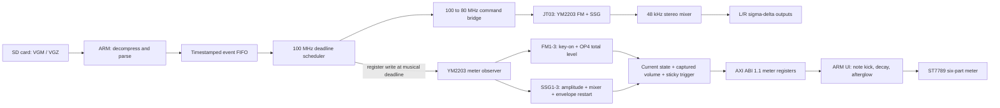

# Event-driven YM2203 playback and meters

The observer is driven by the register write emitted at the hardware playback
deadline, not by the parser. Consequently, SD reading, gzip decompression, and
FIFO preloading cannot make the display run ahead of the audible JT03 output.

MDX and VGM/VGZ now share the same UI animation. Their volume sources differ:
MXDRV supplies its logical part volume for MDX, while the YM2203 observer uses
operator 4 total level for FM and the amplitude/envelope setting for SSG.
